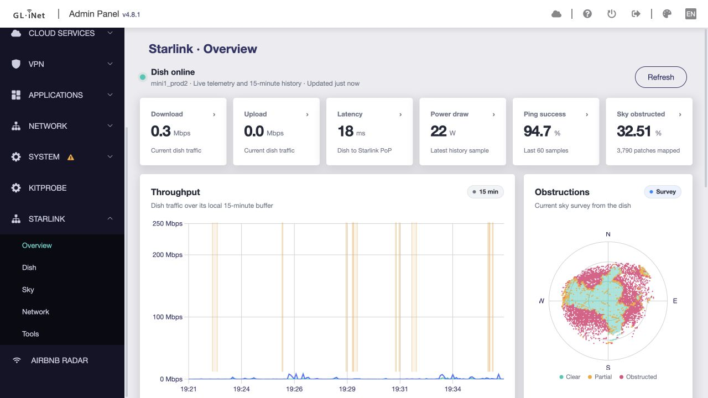

# Starlink Monitor

Native GL.iNet SDK4 dashboard for a Starlink dish reachable at
`192.168.100.1:9201`.

Built with [`gl-sdk4-plugin-kit`](https://github.com/go-wombat/gl-sdk4-plugin-kit).



The plugin is deliberately on-demand:

- no init service or historian is installed;
- no telemetry is written to flash;
- the CGI proxy runs only while an authenticated admin page requests data;
- polling pauses while the page is hidden and stops when it is closed;
- charts use the dish's own 15-minute, one-second ring buffer.

The native `Starlink` submenu contains five focused views:

- **Overview** — live status plus the dish's own 15-minute throughput, latency,
  ping-success and power history;
- **Dish** — alignment instruments, model and firmware details, readiness and
  active terminal alerts;
- **Sky** — a large obstruction survey, sky coverage metrics and current pointing;
- **Network** — read-only GL.iNet client and link counters related to the local
  Starlink setup;
- **Tools** — a user-triggered browser speed test and one-shot local diagnostics.

Overview, Dish, and Sky update automatically only while their page is visible.
Tools never starts work by itself. Closing or hiding a page stops its timers and
aborts active requests; no history is maintained by the router.

History is refreshed every three seconds. Throughput, latency, and power axes
start from fixed practical baselines and may only grow to a rounded maximum
during the current page session; a lower subsequent sample never rescales the
chart. Outage bands use the event start time and cause as their stable identity,
are rendered in chronological order, and move left together with the rolling
15-minute window. Scaling, in-place native chart updates, and outage rendering
are provided by the shared `GlStableLineChart` adapter from
`gl-sdk4-plugin-kit`; the plugin contains no separate chart scaling engine.

## Build

```bash
git clone https://github.com/go-wombat/starlink-monitor.git
cd starlink-monitor
npm install
npm test
npm run check
npm run build
npm run package
```

The generated OpenWrt package is written to `dist/`. Install it with
`npm run router:install` after configuring the router connection used by the
SDK CLI.

The full-stack package depends on OpenWrt's `curl` package. Its only router-side
executable is `/www/cgi-bin/gl-starlink-monitor`, a fixed read-only proxy for
the three protobuf requests used by the UI.

## Safety boundary

The proxy accepts only `status`, `history`, and `obstruction`. It does not
accept a target URL, request bytes, Starlink account credentials, or write
commands. Starlink's local API is unofficial and may change with firmware.

See [THIRD_PARTY_NOTICES.md](THIRD_PARTY_NOTICES.md) for the Dishylink MIT
attribution.
